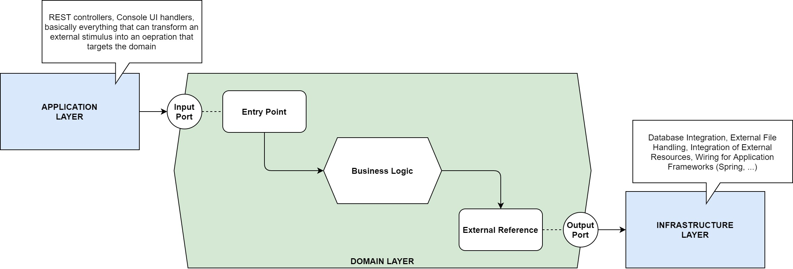
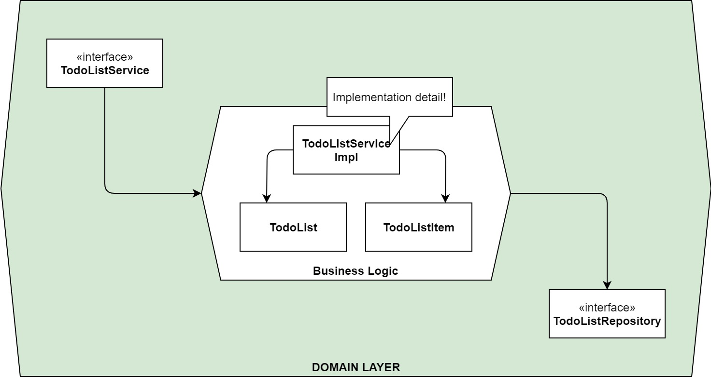

# Hexagonal Architecture with Spring Boot and JPMS

## Concept

A hexagonal architecture implements the ports and adapters pattern. Thus, we refer to the core of the application as the domain layer (the hexagon), that implements the business functionality of our application. This business functionality has no ties to any external resource, e.g. database integration or the like. This has the benefit that the core of the application is easily testable. The core in a hexagonal architecture has well defined interfaces (or: ports and adapters, hence the name of the pattern) for dealing with external stimuli such as user inputs (the application layer) and the integration with external resources as outputs (the infrastructure layer). For instance, the application layer might implement a RESTful HTTP interface that uses the inbound port of the domain layer to execute a specific use case. On the other hand, if some the internal state of the domain has been altered and has to be persisted, an database-centric implementation of the resp. outbound adapter might provide the means to do just that. Thus, *ports and adapters* establish a bridge between the actual business functionality and everything else that needs to be in place to run the entire application.

<div align="center">
    <div></div>
</div>

The domain layer defines interfaces for the resp. ports and adapters. It is agnostic to their implementation. We'll provide the resp. implementation details as part of Java modules of the application and infrastructure layer and let the application framework - Spring in this case - do the necessary wiring.

<div align="center">
    <div></div>
</div>

## Caveats

* Lombok (1.18.20 - latest as of 2021-07-20) seems not to work with the JPMS unless you tweak the build a bit. Apparently, there are fixes for the faulty behavior (cf. https://github.com/projectlombok/lombok/issues/1723), but for this example, I removed Lombok from the codebase.
* `package org.springframework.format.annotation is declared in the unnamed module, but module todo.app.rest does not read it`. This happens when a 3rd-party-dependency is not modularized. We must use the auto-generated module name to include the dependency properly. In this case, the auto-generated name is `spring.context`. Rinse and repeat for every other 3rd-party-dependency that generates this error.
* Some 3rd-party-dependencies behave problematic in the presence of Java modules. For instance, Spring Fox is - after the initial issue was raised over 3 years ago (cf. https://github.com/springfox/springfox/issues/2064) - still stuck in the past. Sometimes there is just no other way than to look for an alternative implementation and drop the offending 3rd-party-dependency in favor of Java modules. In the case of Spring Fox, this is transitive and a real problem, if you rely on OpenAPI and the Maven Plugin for class generation from a specification. The `openapi-generator-maven-plugin` only supports the Spring Fox integration when using Spring-related generators, so you're kind of stuck in the past with this setup.
* `Caused by: java.lang.IllegalAccessException: module todo.rest.app does not open net.mguenther.todo to module spring.core`
* Use the `@Service` annotation instead of `@Repository`, otherwise bean creation is broken (probably due to some other missing requirement). If you annotate a bean with `@Repository`, the following error is created:

```
org.springframework.beans.factory.BeanCreationException: Error creating bean with name 'todoListRepositoryJpa' defined in file [C:\Workspace\todo-list-jpms\todo-list-jpms-persistence-jpa\target\classes\net\mguenther\todo\persistence\jpa\TodoListRepositoryJpa.class]: Initialization of bean failed; nested exception is org.springframework.aop.framework.AopConfigException: Unexpected AOP exception; nested exception is org.springframework.aop.framework.AopConfigException: Unable to instantiate proxy using Objenesis, and regular proxy instantiation via default constructor fails as well; nested exception is java.lang.NoSuchMethodException: net.mguenther.todo.persistence.jpa.TodoListRepositoryJpa$$EnhancerBySpringCGLIB$$686b0b91.<init>()
	at spring.beans@5.3.8/org.springframework.beans.factory.support.AbstractAutowireCapableBeanFactory.doCreateBean(AbstractAutowireCapableBeanFactory.java:610)
	at spring.beans@5.3.8/org.springframework.beans.factory.support.AbstractAutowireCapableBeanFactory.createBean(AbstractAutowireCapableBeanFactory.java:524)
	at spring.beans@5.3.8/org.springframework.beans.factory.support.AbstractBeanFactory.lambda$doGetBean$0(AbstractBeanFactory.java:335)
	at spring.beans@5.3.8/org.springframework.beans.factory.support.DefaultSingletonBeanRegistry.getSingleton(DefaultSingletonBeanRegistry.java:234)
	at spring.beans@5.3.8/org.springframework.beans.factory.support.AbstractBeanFactory.doGetBean(AbstractBeanFactory.java:333)
	at spring.beans@5.3.8/org.springframework.beans.factory.support.AbstractBeanFactory.getBean(AbstractBeanFactory.java:208)
	at spring.beans@5.3.8/org.springframework.beans.factory.support.DefaultListableBeanFactory.preInstantiateSingletons(DefaultListableBeanFactory.java:944)
	at spring.context@5.3.8/org.springframework.context.support.AbstractApplicationContext.finishBeanFactoryInitialization(AbstractApplicationContext.java:918)
	at spring.context@5.3.8/org.springframework.context.support.AbstractApplicationContext.refresh(AbstractApplicationContext.java:583)
	at spring.boot@2.5.2/org.springframework.boot.web.servlet.context.ServletWebServerApplicationContext.refresh(ServletWebServerApplicationContext.java:145)
	at spring.boot@2.5.2/org.springframework.boot.SpringApplication.refresh(SpringApplication.java:754)
	at spring.boot@2.5.2/org.springframework.boot.SpringApplication.refreshContext(SpringApplication.java:434)
	at spring.boot@2.5.2/org.springframework.boot.SpringApplication.run(SpringApplication.java:338)
	at spring.boot@2.5.2/org.springframework.boot.SpringApplication.run(SpringApplication.java:1343)
	at spring.boot@2.5.2/org.springframework.boot.SpringApplication.run(SpringApplication.java:1332)
	at todo.rest.app/net.mguenther.todo.TodoRestApplication.main(TodoRestApplication.java:11)
Caused by: org.springframework.aop.framework.AopConfigException: Unexpected AOP exception; nested exception is org.springframework.aop.framework.AopConfigException: Unable to instantiate proxy using Objenesis, and regular proxy instantiation via default constructor fails as well; nested exception is java.lang.NoSuchMethodException: net.mguenther.todo.persistence.jpa.TodoListRepositoryJpa$$EnhancerBySpringCGLIB$$686b0b91.<init>()
	at spring.aop@5.3.8/org.springframework.aop.framework.CglibAopProxy.getProxy(CglibAopProxy.java:215)
	at spring.aop@5.3.8/org.springframework.aop.framework.ProxyFactory.getProxy(ProxyFactory.java:110)
	at spring.aop@5.3.8/org.springframework.aop.framework.AbstractAdvisingBeanPostProcessor.postProcessAfterInitialization(AbstractAdvisingBeanPostProcessor.java:99)
	at spring.beans@5.3.8/org.springframework.beans.factory.support.AbstractAutowireCapableBeanFactory.applyBeanPostProcessorsAfterInitialization(AbstractAutowireCapableBeanFactory.java:437)
	at spring.beans@5.3.8/org.springframework.beans.factory.support.AbstractAutowireCapableBeanFactory.initializeBean(AbstractAutowireCapableBeanFactory.java:1790)
	at spring.beans@5.3.8/org.springframework.beans.factory.support.AbstractAutowireCapableBeanFactory.doCreateBean(AbstractAutowireCapableBeanFactory.java:602)
	... 15 more
Caused by: org.springframework.aop.framework.AopConfigException: Unable to instantiate proxy using Objenesis, and regular proxy instantiation via default constructor fails as well; nested exception is java.lang.NoSuchMethodException: net.mguenther.todo.persistence.jpa.TodoListRepositoryJpa$$EnhancerBySpringCGLIB$$686b0b91.<init>()
	at spring.aop@5.3.8/org.springframework.aop.framework.ObjenesisCglibAopProxy.createProxyClassAndInstance(ObjenesisCglibAopProxy.java:81)
	at spring.aop@5.3.8/org.springframework.aop.framework.CglibAopProxy.getProxy(CglibAopProxy.java:206)
	... 20 more
Caused by: java.lang.NoSuchMethodException: net.mguenther.todo.persistence.jpa.TodoListRepositoryJpa$$EnhancerBySpringCGLIB$$686b0b91.<init>()
	at java.base/java.lang.Class.getConstructor0(Class.java:3508)
	at java.base/java.lang.Class.getDeclaredConstructor(Class.java:2711)
	at spring.aop@5.3.8/org.springframework.aop.framework.ObjenesisCglibAopProxy.createProxyClassAndInstance(ObjenesisCglibAopProxy.java:75)
	... 21 more
```

This can be mitigated by adding a `requires`-relationship to module `jdk.unsupported`, which brings in internal `com.sun.*` packages that Objenesis relies on (cf. `com.sun.reflect`).

### Wiring beans explicitly vs. wiring beans dynamically

If you want to wire your beans explicitly in the infrastructure layer, then you have to open up all packages in dependent modules that contain implementation details. Suppose you have the following configuration class as part of your infrastructure layer:

```java
@Configuration
public class TodoRestApplicationConfig {

    @Bean
    public TodoListService todoListService(TodoListRepository repository) {
        return new TodoListServiceImpl(repository);
    }
}
```

This will only work if the module that contains the implementing class `TodoListServiceImpl` explicitly exports the package that contains this class. This against the strong encapsulation that we seek to achieve by employing the JPMS.

You can of course rely on the auto-wiring capabilities of Spring by using stereotype annotations. This has the impact that Spring-specific code wanders into modules of the domain, which is unfavourable. But this is the only way to keep the strong encapsulation of your module intact.

Annotate the implementing class as appropriate

```java
package net.mguenther.todo.domain.impl;

@Component
public class TodoListServiceImpl implements TodoListService {
  // your implementation goes here
}
```

and open the package in the `module-info.java` as follows. This comes with a requirement on module `spring.context`.

```java
module todo.domain {

  exports net.mguenther.todo.domain;
  
  requires spring.context;
  
  opens net.mguenther.todo.domain.impl to spring.core, spring.beans, spring.context;
}
```

### Move Spring component configuration into module

Create a `*.config` package and put everything related to the Spring component configuration in there. Be sure that you use conditionals (cf. `@ConditionalOnMissingBean` for instance) on all beans that you create as part of that `@Configuration`. Or use a module solely for configuring things and establish a `requires`-dependency between the module that contains the Spring component and its configuration (in case other modules need to use this configuration as well).